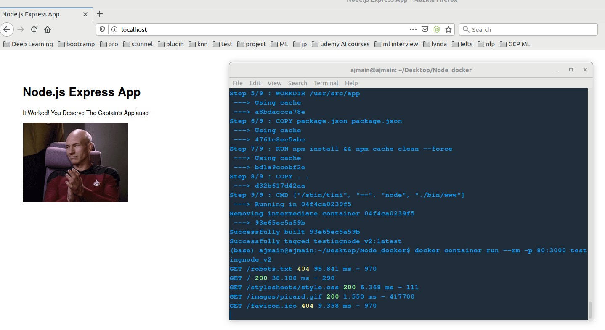

<h1>Own docker and Run from Container</h1>

 

<h4>This is my first docker file</h4>

 

I have created own dockerfile using image of Node js 13-alpine version. Docker hub link: <a href="https://hub.docker.com/_/node">Node js in Docker Hub</a>

 

The main file is named "Dockerfile"

 

To run this docker as container, please run the following command:

 

docker container run -p 80:3000 ajmainalam/node_docker

 
80 => Listing port of client (own) device browser 

 

3000 => Listing port of docker.

 

After running this command, go to your browser and visit url: http://localhost

 

It should pop up below image:

 

To access from docker hub follow this link: <a href="https://hub.docker.com/r/ajmainalam/node_docker">Node Docker</a>

